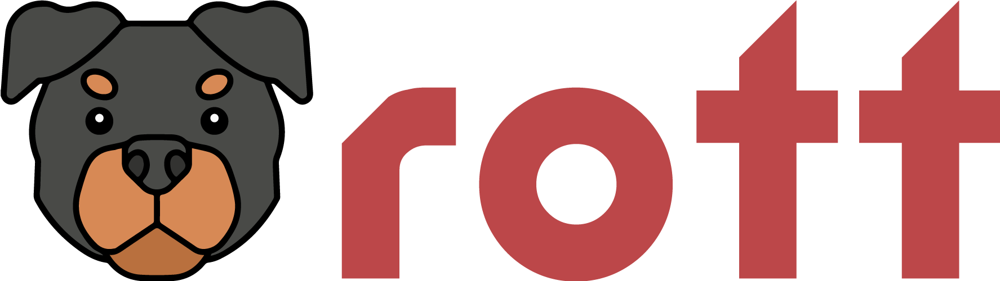

# Welcome to Rott.dev

This is a tool to improve code quality and repository standards.

It is composed by an action that runs on your CI and process repository data to generate a score base on rules inside the rott.json file or using a shared rules file.
The shared rules file is a file in another reporitory, please refer to [action repository](https://github.com/rott-dev/action) to see how to use it.

## Usage

See it in action in [this](https://github.com/rott-dev/sample-repo) repository, the action is running on every push.
